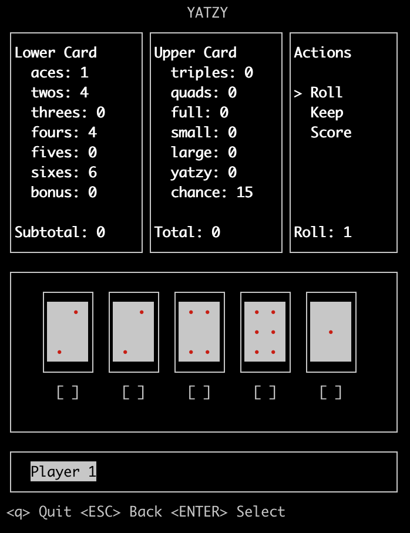

# Yatzy in the terminal!
Yatzy is a curses application written in Python that lets you play the classic dice game right in your terminal.



---

## How to play
Yatzy is a game played with five dice. Each player gets three rolls and can choose to keep certain dice between each roll. The player must enter a score in one of the categories even if it's a zero.

For a detailed description of the rules check out [Game Rules](https://gamerules.com/rules/yahtzee-dice-game/ 'Full Game Rules')

---

## Basic Usage

Running the game is as simple as entering...
```
$ python3 main.py
```

The game is controlled using:
* **ENTER** for selection
* **ARROW KEYS** for navigation
* **ESC** for back
* **Q** for quitting the game

---

## Contact
Joel Buchheim-Moore => joelbm24@gmail.com